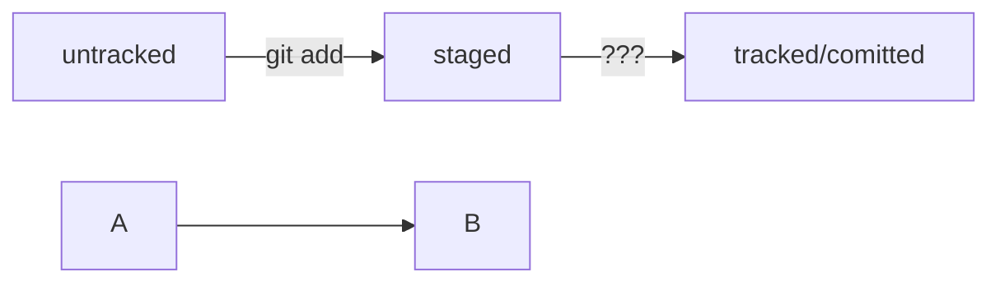

# Шпаргалка по Git

## Основные команды

### Работа с репозиторием

- `git init` - инициализация нового репозитория
- `git clone <URL>` - клонирование репозитория
- `git remote add origin <URL>` - добавление удаленного репозитория
- `git pull origin <branch>` - получение и объединение изменений из удаленного репозитория
- `git push origin <branch>` - отправка изменений в удаленный репозиторий
- `git branch <branch>` - создание новой ветки
- `git checkout <branch>` - переключение на другую ветку
- `git merge <branch>` - объединение веток

### Работа с изменениями

- `git status` - проверка состояния репозитория
- `git add <file>` - добавление файла в индекс
- `git commit -m "Сообщение"` - создание коммита с сообщением
	- `git commit --amend --no-edit` - дополнить коммит новыми файлами

- `git diff` - просмотр изменений в файлах
- `git log` - просмотр истории коммитов
	- `git log --oneline` - сокращённый лог c автоподбором
	- `git commit --amend -m "Обновлённое сообщение коммита"` - изменить сообщение к коммиту

### Отмена изменений

- `git reset <commit>` - отмена коммита и сохранение изменений
- `git revert <commit>` - создание нового коммита, отменяющего изменения
- `git checkout -- <file>` - отмена изменений в файле

## Расширенные возможности

- `git stash` - временное сохранение изменений
- `git rebase` - изменение истории коммитов
- `git cherry-pick <commit>` - применение коммита из другой ветки
- `git bisect` - поиск коммита, в котором возникла проблема

